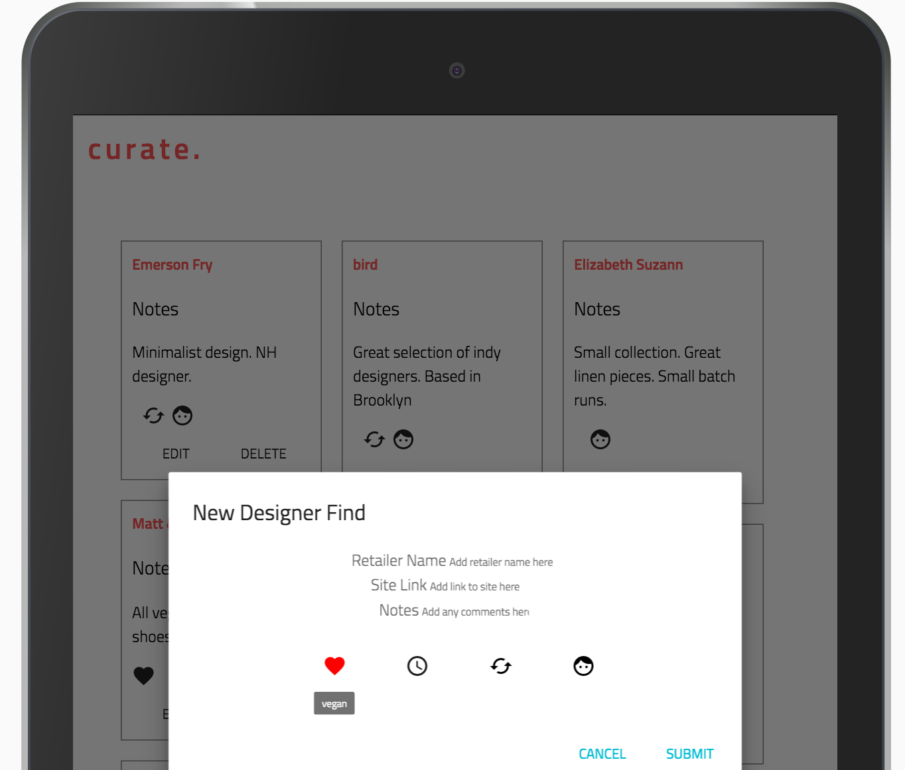
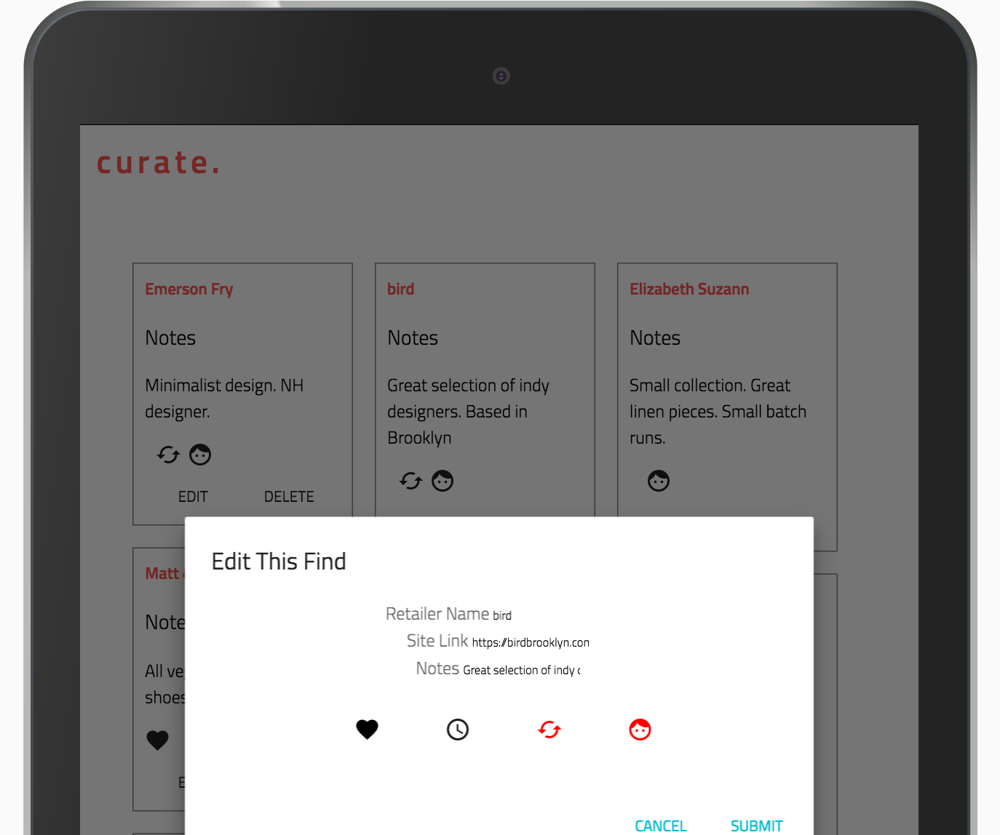

This project was bootstrapped with [Create React App](https://github.com/facebookincubator/create-react-app).

## curate-client

## About the app

curate. is a clean and simple way to manage retail sources who align with your values. curate. lets you track details on your favorite vegan and earth-friendly resources in one place! Create and edit your list of retails finds as they evolve.

### How it works

A user must create an account and authenticate to access curate.

Once signed in, a user can see all retail profiles they have saved under their account.

A user creates an new profile by selecting the icon in the bottom navigation bar. An input form is displayed with options to save the new profile or discard it.

Once a retail profile is saved, it is dynamically added to the user's list.

A user can edit a profile by selecting the edit button for the appropriate profile. An edit form will display with the unedited text.

Select submit to apply the changes and navigate back to the main dashboard.

To sign out, select the log out button at the bottom of the screen. Users are brought back to the sign in menu.

The design is optimized for any size device. Ideas display in multiple columns on wider screens.

## Project Planning

### Approach

 - Before doing any coding, I put together some wireframes and documented the ERD for this project. I decided on a simple one-to-many relationship between users and retail profiles because I anticipated progress would be slow as a first-time user of React (I was correct). I mapped out what I would need for fields on the new resource before moving on.
 - I started with validating the authentication functionality on the back end by creating curl scripts. Authentication was provided in the API already, but not in the React template. This was a natural place to start. Building out the authentication forms was a good introduction to how data flows in React and how to code in JSX. True to the theme of this project, it took a lot longer than I anticipated.
 - I did my best to leverage reusable components, where possible. I'm still building my intuition around how best to structure an app around components, but many of the forms leverage the same input field components.
 - I built out the retailprofiles model and controller in Express and got the MongoDB for the project up. I created scripts to validate the routes I would need (outlined in the API README linked above).
 - Most of the week was thrashing on the way React passes data between components, and how to get the desired behavior for even simple things I was able to do quickly with jQuery and browser template.
 - Once all functioanlity was validated, I spent what little time I had left styling the front end. I added the menu (which require a surprising amount of refactorig code) and incororated a nicely scrolling ui. I tested the app on different devices and browsers to confirm it was compatible.

### Wireframes and Models

[ERD](img/ERD.JPG) 
[Wire Frames](imgs/wireframes.JPG) 

Find the app [here](https://danielleletarte.github.io/mind-cloud-client/) 
Find the mindCloud API repo [here](https://github.com/danielleletarte/mind-cloud-api)

### User Stories

 - As a vegan with an interest in fashion, I want a quick and simple way to track clothing resources I love that do good for animals and the environment.
 - As a user, I want to be able to view my full inventory of retailers and easily link to their websites.
 - As a user, I want my ideas to display cleanly on any device I use.
 - As a user, I want the ability to quickly filter on resources that are either vegan, independent etc. (STRETCH - Not Completed).
 - As a user, I want the ability to upload a photo for each new resource I add (STRETCH - Not Completed).

 ## [License](LICENSE)

 1.  All content is licensed under a CC­BY­NC­SA 4.0 license.
 1.  All software code is licensed under GNU GPLv3. For commercial use or
     alternative licensing, please contact legal@ga.co.
